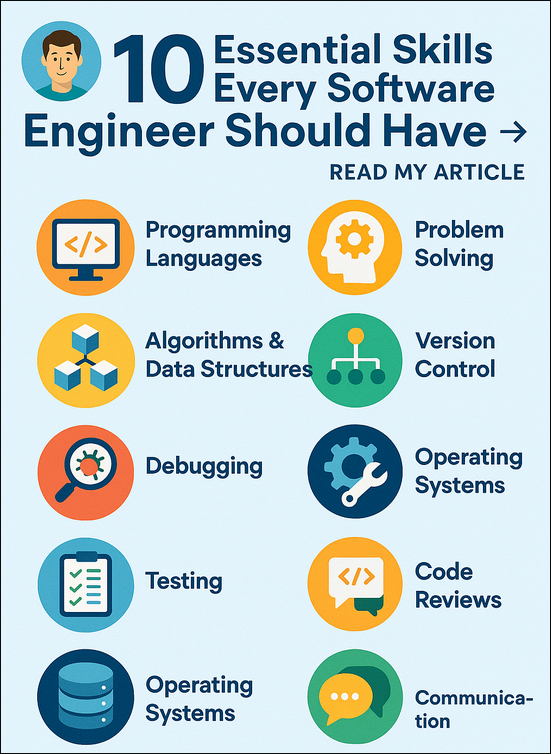

# 10 Essential Skills Every Software Engineer Should Have

In the rapidly evolving world of technology, the term “software engineer” has become a bit of a catch-all. Yet the truth remains: successful software engineers aren't defined by titles, degrees, or how many programming languages they list on their résumés. 

They're defined by a blend of technical depth, problem-solving acumen, adaptability, and soft skills that enable them to build scalable systems, debug effectively, and collaborate with diverse teams.

This article unpacks the 10 essential skills every software engineer should master, not just to thrive in today's landscape—but to remain indispensable tomorrow.

1. Deep Understanding of Programming Languages

At the heart of every great software engineer lies fluency in at least one modern programming language. Whether it’s Python for automation and AI, JavaScript for web interfaces, or C++ for system-level development, understanding the syntax, idioms, and ecosystem of a language is non-negotiable.

But it’s not just about knowing a language—it’s about knowing how and when to use it.

Do you understand memory management in low-level languages?

Can you optimize for performance when needed?

Do you know the difference between functional, object-oriented, and procedural paradigms?

Investing in depth (not just breadth) of language knowledge makes you a more efficient, confident, and creative engineer.

2. Mastery of Algorithms & Data Structures

Want to stand out in interviews, solve complex problems faster, or write code that scales? Algorithms and data structures are your toolkit.

You should understand:

Common algorithms: sorting, searching, traversal, recursion, dynamic programming.

Core data structures: arrays, lists, trees, graphs, heaps, stacks, and queues.

Time and space complexity: Big O notation and tradeoffs.

When to use what: Hash maps vs trees? Linked lists or arrays?

Most real-world software problems don’t require new algorithms—but they do require applying existing ones smartly. The difference between good code and great software is often how elegantly it handles data.

3. Strong Problem-Solving Skills

Programming is a form of creative problem-solving. You’re rarely writing code in a vacuum—you’re designing features to solve user needs, fixing production issues, or improving performance under tight constraints.

Effective problem solvers:

Break down ambiguous problems into smaller, testable components.

Approach debugging methodically (and resist the urge to guess).

Ask the right questions: What’s failing? Where? Why now?

Know how to Google smartly—and when to stop relying on Stack Overflow.

The best engineers don’t panic under pressure. They diagnose, isolate, and iterate.

4. Version Control Proficiency (Git is Mandatory)

Version control isn’t optional anymore. Whether you’re part of a large enterprise team or hacking solo side projects, Git is the industry standard.

You should be fluent in:

Branching and merging strategies.

Resolving merge conflicts.

Reverting, rebasing, and cherry-picking.

Collaborating via pull requests, feature branches, and CI workflows.

Understanding how to structure your commits, write meaningful commit messages, and track changes intelligently is a mark of a mature engineer.

5. Debugging: The Unsung Hero Skill

Let’s face it—code doesn’t always work the first time. Or the second. Or after 5 hours of caffeine-fueled effort.

Debugging is where software engineers earn their stripes.

It’s not just about finding and fixing bugs. It’s about:

Understanding log output.

Using debuggers and breakpoints efficiently.

Reading stack traces.

Writing tests to isolate behavior.

Knowing what “working” actually looks like.

Debugging sharpens your understanding of how your code interacts with the system. It builds intuition and patience. And it teaches humility.

6. Operating System Fundamentals

You don’t need to write a kernel, but if you’ve never wondered what exactly happens when I run my code, it’s time to start.

Every software engineer should understand:

How memory is managed (stack vs heap).

What system calls are and how they work.

How processes and threads are handled.

Basics of file systems and I/O operations.

Signals, interrupts, and context switching.

Even web developers benefit from understanding the OS—they deploy to servers, manage containers, and optimize for performance.

7. Testing: Beyond Just “It Works”

Testing is about trust—can you trust that your software will do what it’s supposed to do tomorrow, under different inputs, at scale?

Essential testing skills include:

Writing unit tests and integration tests.

Knowing when to use mocks or test doubles.

Using testing frameworks effectively (Jest, PyTest, JUnit, etc.).

Understanding Test-Driven Development (TDD) principles.

Setting up CI/CD pipelines that catch regressions early.

A software engineer who writes tests is an engineer who cares. About users. About uptime. About not waking up at 2 a.m. because prod is down.

8. Code Review Etiquette (and Ego-Free Collaboration)

Every engineer writes bugs. Great engineers let others catch them.

Code reviews are not just about finding errors. They're about:

Enforcing coding standards.

Sharing context and rationale.

Asking questions instead of making assumptions.

Giving respectful, actionable feedback.

Accepting critiques without defensiveness.

Code review is a communication exercise wrapped in a technical process. Mastering it means becoming a better teammate—and a better developer.

9. Communication Skills: Tech Is a Team Sport

Forget the stereotype of the hoodie-wearing genius typing alone in the dark.

Modern software engineering is collaborative. You work with product managers, designers, business stakeholders, and other engineers. Often across time zones and cultures.

Key communication skills:

Writing clear documentation and README files.

Participating effectively in stand-ups and sprint planning.

Explaining technical concepts to non-technical colleagues.

Asking for help without fear or shame.

Giving updates that are concise and relevant.

The more clearly you can articulate your thoughts, the more impact your ideas will have.

10. Lifelong Learning Mindset

This might be the most critical skill of all.

Tech moves fast. Languages evolve. Frameworks get deprecated. New paradigms emerge. What you knew five years ago might be irrelevant today.

The best engineers are curious, adaptable, and unafraid to re-learn. They:

Read docs. Not just tutorials.

Stay active in developer communities.

Embrace feedback.

Build side projects.

Take breaks to reflect and avoid burnout.

Complacency is your biggest threat. A learning mindset is your biggest advantage.

Final Thoughts: You’re More Than Just a Coder

These 10 skills form a solid foundation for any software engineer—but here’s the truth: they’re only the beginning.

The real value comes in how you apply them. How you balance hard skills with human empathy. How you troubleshoot under pressure, communicate with clarity, and build with purpose.

Whether you're just starting out or leading a team, the most successful engineers are those who never stop evolving—technically and personally.

