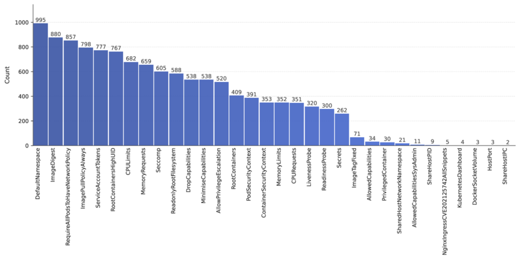
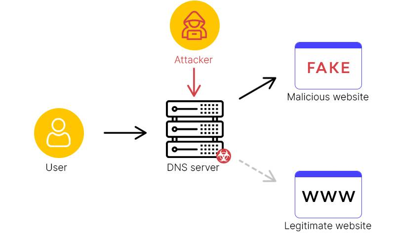

# Domain Hosting Security Flaws: Misconfigurations, Domain Hijacking, and Beyond

Managing a domain and web hosting account might seem routine, but security lapses can have devastating consequences. From server misconfigurations to registrar-level attacks, flaws in domain hosting setups have enabled data breaches, impersonation, and downtime for businesses.

This article examines common hosting-related vulnerabilities – **server misconfigurations, domain hijacking, DNS-level attacks, SSL/TLS issues, weak hosting credentials** – with real-world examples and recommendations. Suggestions for charts/flowcharts are included (e.g., pie chart of misconfiguration types, timeline of hijacking incidents).

---

## Server Misconfigurations: Open Doors for Attackers

- **OWASP Top 10 (2021):** “Security Misconfiguration” ranked among the most critical weaknesses.
- **Stats:** ~73% of organizations suffer at least one critical misconfiguration.
- **Examples:**
  - Default admin credentials (`tomcat admin/admin`)
  - Verbose error messages / exposed stack traces
  - Enabled directory browsing
  - Loose Unix file permissions
  - Default NGINX/Apache placeholder pages

**Visualization:** A pie chart of common misconfigurations (unpatched software, open directory listings, default credentials, excessive permissions).

**Mitigation:**

- Audit NGINX/Apache configs, container settings, and cloud rules
- Disable directory listing, remove sample/demo pages
- Automate configuration hardening (e.g., Ansible, Puppet)

---

## Domain Hijacking: Stealing Your Online Identity

- **Definition:** Attackers seize control of a domain, redirecting traffic and email.
- **Impact:** Phishing, credential theft, reputational damage.
- **Case Study:** Hypixel Network (10M+ users) had its domain stolen in May 2022, leading to phishing scams.

**“Sitting Ducks” Technique (Infoblox):**

- Attacker exploits weak DNS delegation
- Registers malicious DNS account for target domain
- Alters records without registrar login

**Stats:** Infoblox found ~800,000 risky domains; ~70,000 hijacked.

**Visualization:** Flowchart of hijacking process: reconnaissance → weak delegation → malicious DNS account → DNS takeover.

Distribution of security misconfiguration types in our dataset collected from ArtifactHub. The chart illustrates the relative frequency of different security issues detected by SATs across 1,000 configuration files, highlighting the prevalence of specific vulnerability patterns in real-world container configurations:

---

## DNS Vulnerabilities: Spoofing and Cache Poisoning

- **DNS spoofing/cache poisoning:** Injecting forged DNS answers.
- **Notable Attacks:**
  - 2008 Kaminsky exploit (transaction ID weaknesses)
  - 2023 MaginotDNS (TLD-level poisoning)

**Risks:**

- Lack of DNSSEC leaves replies unauthenticated
- Typosquatting/expired domains create impersonation vectors

**Visualization:** Line graph of DNS attack trends over time.

**Mitigation:**

- Registrar locks, DNSSEC
- Monitor zone-change logs
- Use secure resolvers (DoH, DoT)

---

## SSL/TLS Issues: Expired and Misissued Certificates

- **Expired certs:** Cause browser warnings and service outages
- **Misissued certs:**
  - Example: DigiNotar breach (2011) issued rogue Gmail certs in Iran
  - Study: 42% of misissuance incidents due to CA errors

**Visualization:** Pie chart of TLS failures (expired, revoked, misissued, chain errors).

**Mitigation:**

- Automate renewals (e.g., Let’s Encrypt)
- Monitor certificate transparency logs
- Use strong ciphers and update configs

---

## Hosting Provider Weaknesses

- **Shared hosting risks:** One tenant compromise can spread laterally.
- **Examples:** Misconfigured control panels, outdated management software, weak isolation.
- **False assurances:** Providers often claim strong isolation without proof.

**Visualization:** Comparative chart: shared hosting risks vs. dedicated/VPS isolation.

**Mitigation:**

- Ask providers about tenant isolation (VMs, containers, VLANs)
- Prefer dedicated or VPS hosting for critical apps
- Validate provider’s security features (firewalls, DDoS protection)

---

## Poor Credential Management

- **Common pitfalls:** Password reuse, no MFA, stale API keys
- **Real-world:** Hypixel hijack linked to leaked credentials; “Sitting Ducks” relies on DNS provider account abuse

**Visualization:** Bar chart of breach causes (phishing, brute force, credential stuffing).

**Mitigation:**

- Use strong, unique passwords (password manager)
- Enforce MFA, prefer hardware keys
- Monitor login attempts and enable registrar locks

---

## Practical Checklist for Secure Domain Hosting

1. **Harden Server Configurations:** Disable directory listings, remove sample pages, patch OS/apps.
2. **Secure Defaults:** Change default logins, disable unused accounts.
3. **Lock and Monitor DNS:** Enable registrar locks, DNSSEC, and alerts for changes.
4. **Enable MFA:** Require MFA on registrar, hosting, and admin accounts.
5. **Automate Cert Management:** Use Let’s Encrypt or enterprise tools; monitor transparency logs.
6. **Audit Hosting Isolation:** Verify separation; use VPS/dedicated hosting if needed.
7. **Use Strong Credentials:** Avoid reuse, rotate passwords, encrypt secrets.
8. **Review Logs:** Watch for anomalies in server, DNS, and registrar logs.
9. **Educate Team:** Train against phishing/social engineering.
10. **Maintain Backups & Recovery Plans:** Keep off-network backups and incident playbooks.
