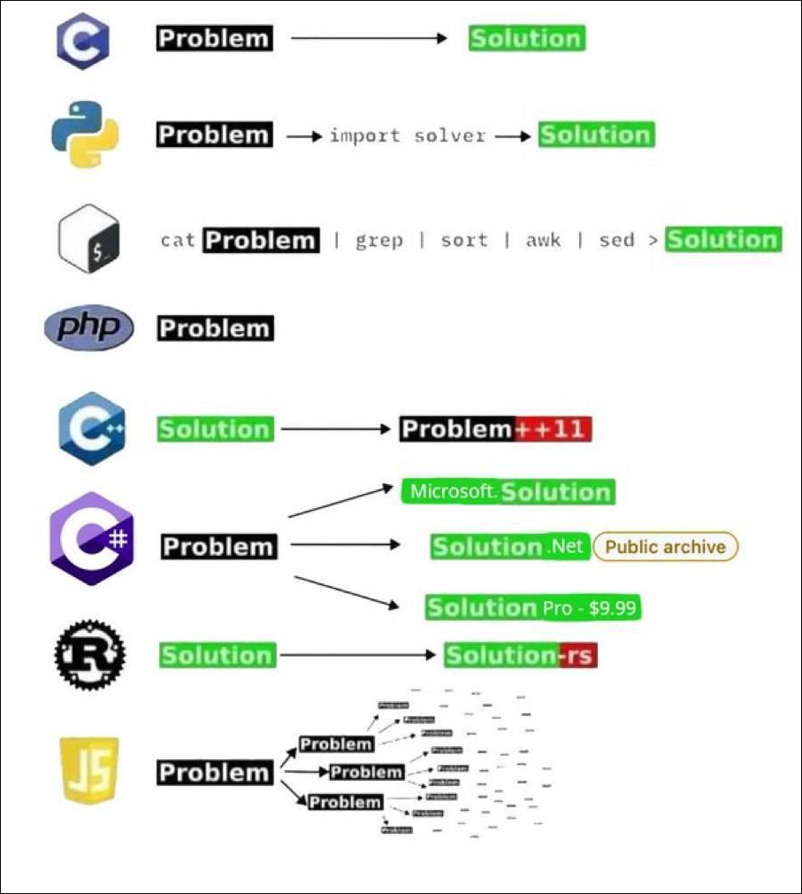

# From Problem to Solution

Every developer’s toolkit tells a story about their approach to solving problems. Whether you crave the raw performance of low‑level code or the convenience of batteries‑included libraries, each language carves its own path. 

In the sections below, we’ll explore how C, Python, the Unix shell, PHP, C++, C#, Rust, and JavaScript each guide you from a “Problem” to a “Solution,” with a few winks at their quirks along the way.

C: The Bare‑Metal Bridge

C doesn’t fuss over abstractions. You sketch out your problem with pointers and structs, wrestle directly with memory allocation, and emerge with a lean, high‑performance solution. There’s a certain honesty in every malloc and free—what you build is purely of your own making. Embrace the power, but be ready for the occasional segmentation fault.

Python: The “Just Import It” Approach

In Python, your struggle often ends at import solver. From data analysis to web servers, there’s a library waiting to turn your problem into a solution. It’s a world of rapid prototyping and readable syntax, tempered by layers of dependencies. You trade granular control for the joy of “it just works”—most of the time.

Unix Shell: Text‑Centric Alchemy

When your data lives in text, the shell pipeline is your artist’s palette. You cat your problem, grep what you need, sculpt with awk, polish with sed, and funnel out your solution. It’s elegant when applied to the right canvas, but less adaptable once you step outside pure text processing.

PHP: The Pragmatic Hack

PHP learned early: if something works and developers adopt it, that’s enough. Your problem meets PHP in tangled templates, mixed SQL, and business logic, and you hope the solution holds together under load. It may not win style awards, but it gets the job done at scale—often in spite of itself.

C++: The Evolving Ecosystem

Think you’ve found the perfect C++ solution? Say hello to Problem++11, Problem++14, Problem++17, and beyond. With each standard comes new features—more templates, paradigms, and gotchas—that expand both your capabilities and your code’s complexity. Mastery feels elusive, but the potential is unrivaled.

C#: The Edition Maze

C# greets you with choices: Microsoft.Solution for enterprise, Solution.Net in the public archives, or Solution Pro at a premium. The ecosystem hums along on .NET’s performance and tooling, yet selecting the right flavor can feel like ordering coffee with 37 milk options. Choose wisely, and you’ll sip smoothly; get it wrong, and you might be stuck with the wrong dependencies.

Rust: The Compiler’s Guardian

Rust flips the script: you define the problem, and the compiler ensures your solution is safe and concurrent. With Cargo’s tidy project structure, your journey is remarkably direct. The learning curve is steep, but once you clear the borrow checker’s hurdles, you emerge confident that memory bugs can’t chase you down.

JavaScript: The Ever‑Expanding Web

JavaScript’s ecosystem is a sprawling city: frameworks sprout like skyscrapers, build tools bridge gaps, and runtimes multiply in every corner. Your single “Problem” spawns dozens of dependencies—React, Vue, Webpack, Node, testing libraries and CSS‑in‑JS—all vying for attention. The power to build anything comes with the chore of keeping up.

In Closing

No language offers a perfect journey from problem to solution. Each arrives with its own promises and pitfalls, shaped by trade‑offs between control, convenience, performance, and complexity. As you weigh your next project—or that dream job—ask not only what the language can do, but how it guides you along the way. After all, the best solution starts with choosing the path that fits both your problem and your style.

