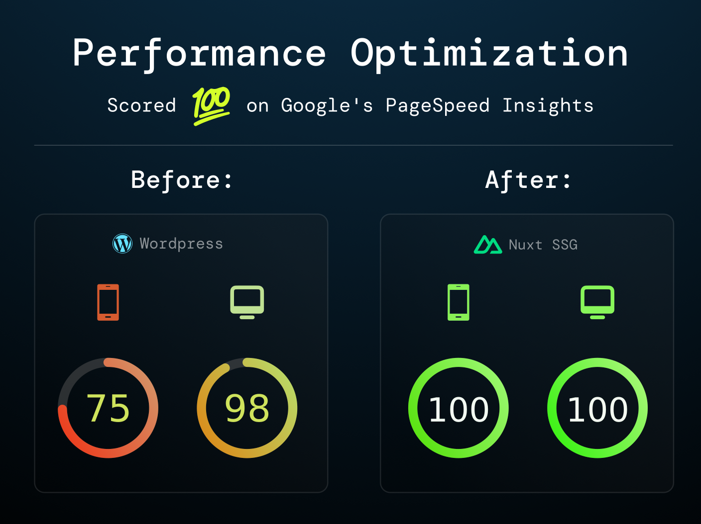

# How I Boosted My Website Performance by Moving from WordPress to Nuxt SSG

For years, my site lived on WordPress. It worked, but it always felt... sluggish. Pages took just a little too long to load, plugins piled up like dust in the corners, and every update brought the fear of something breaking. I kept tweaking caching plugins, CDNs, and image optimizers - yet the speed scores never matched what I wanted.

At some point, I realized the problem wasn't just configuration. It was the foundation. WordPress is powerful, but it’s heavy by nature. My site didn't need a dynamic CMS; most of the content was static. So, I made the jump: I rebuilt it using **Nuxt with Static Site Generation (SSG).**

## The Build Process

Rebuilding wasn't as scary as I thought. With Nuxt, I had full control. I pulled in my old posts, structured them as Markdown, and let Nuxt generate everything at build time. No PHP, no SQL queries, no plugins fighting each other.

I added SCSS for styling, some lightweight components for interactivity, and that was it. Suddenly, I wasn't maintaining dozens of plugins anymore - I was writing clean, predictable code.

The best part? I could version control everything. My content, my design, my configuration—it all lived in Git. If something broke, I could roll back instantly instead of praying to the WordPress backup gods.

## The Results

The first deploy felt like magic.

- Pages loaded instantly, even on mobile data.
- Lighthouse scores jumped into the green without me wrestling with endless optimization settings.
- Hosting costs dropped too—static files don’t need a fancy server.

What surprised me most wasn't just the speed, but the _peace of mind_. I no longer wake up to plugin update warnings or mysterious “database connection errors.” The site just works.

Even SEO improvements came naturally. Search engines love fast-loading pages, and with fewer render-blocking scripts, my rankings improved. My bounce rate dropped as well—people stayed because the site didn't frustrate them with endless loading spinners.

## The Trade-Offs

Of course, it wasn't all sunshine. I gave up the WordPress dashboard, which meant no easy WYSIWYG editor for quick content updates. Writing in Markdown took a bit of adjustment, and deploying changes requires a Git push instead of clicking “Publish.”

But honestly, those "limitations" turned into strengths. Writing in Markdown is cleaner, and it keeps my content portable. Publishing through Git keeps everything structured. I stopped relying on clunky UI buttons and started embracing a workflow that feels closer to development—but still simple enough.

## What I Learned

- WordPress was great, but it's an overkill if your content doesn't change every second (which most of WordPress blogs aren't)
- Nuxt SSG gave me performance _and_ simplicity.
- Less moving parts means fewer headaches.
- Writing in Markdown and deploying via Git is faster than I expected once it became habit.

Switching wasn't just a technical upgrade - it was a mindset shift. I stopped patching a bloated setup and built something lean from the ground up.

If your site feels slow and you’re tired of chasing optimizations, consider whether you actually need WordPress. For me, going static with Nuxt was the best decision I've made for my site in years - and I can't imagine going back.
