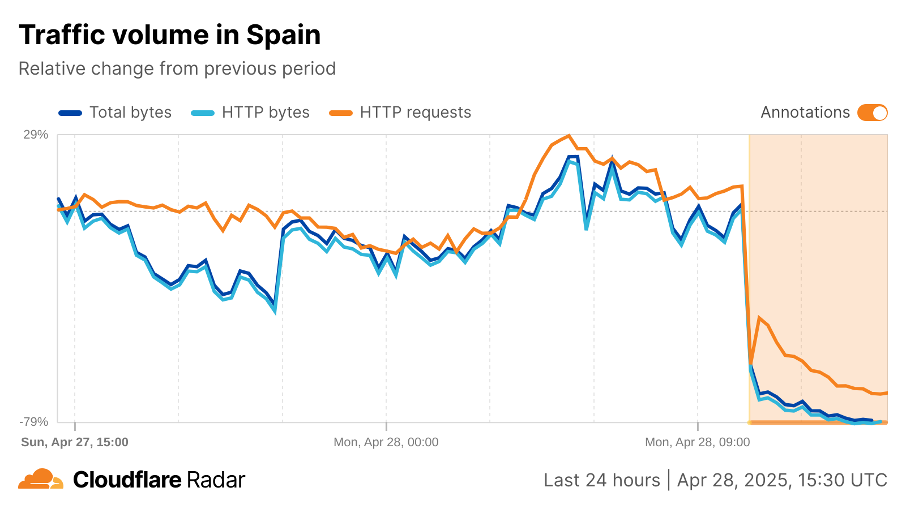
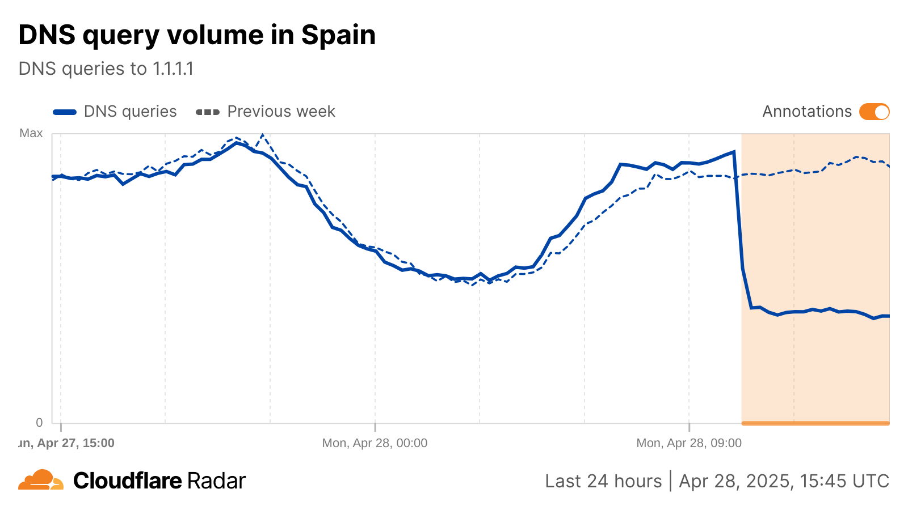
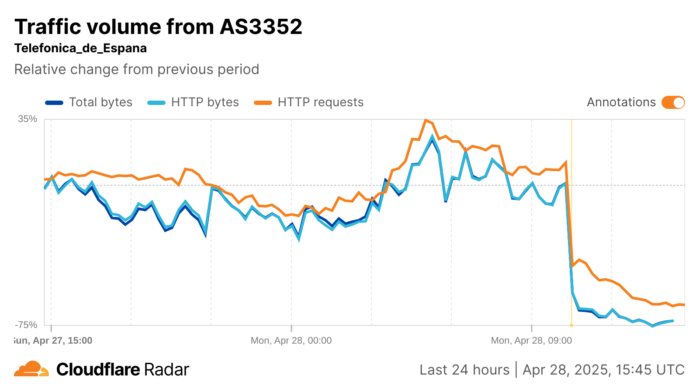
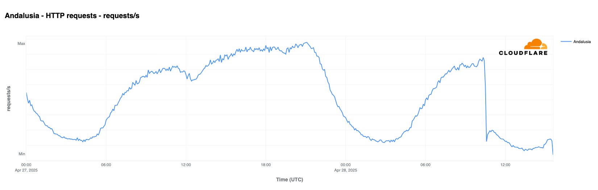
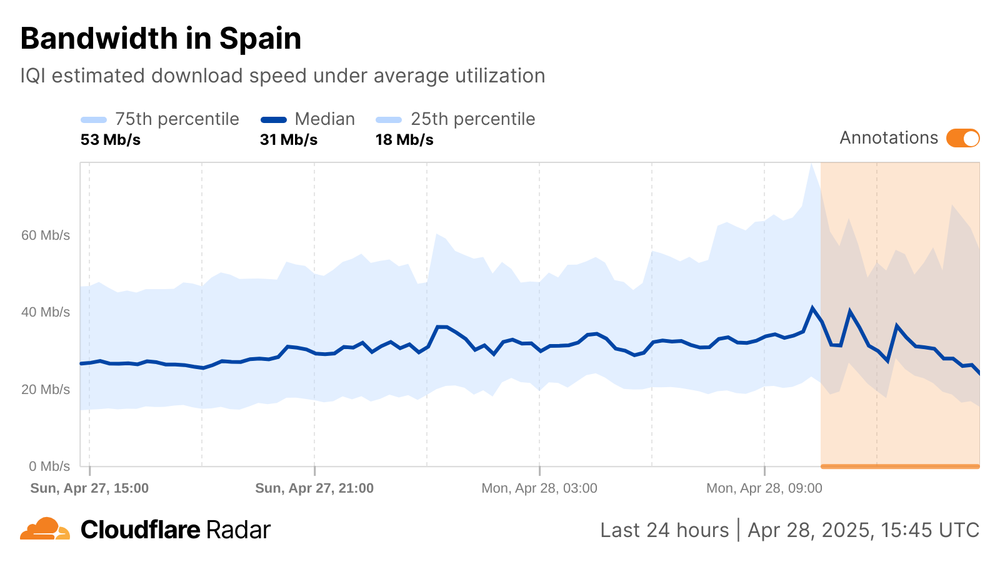
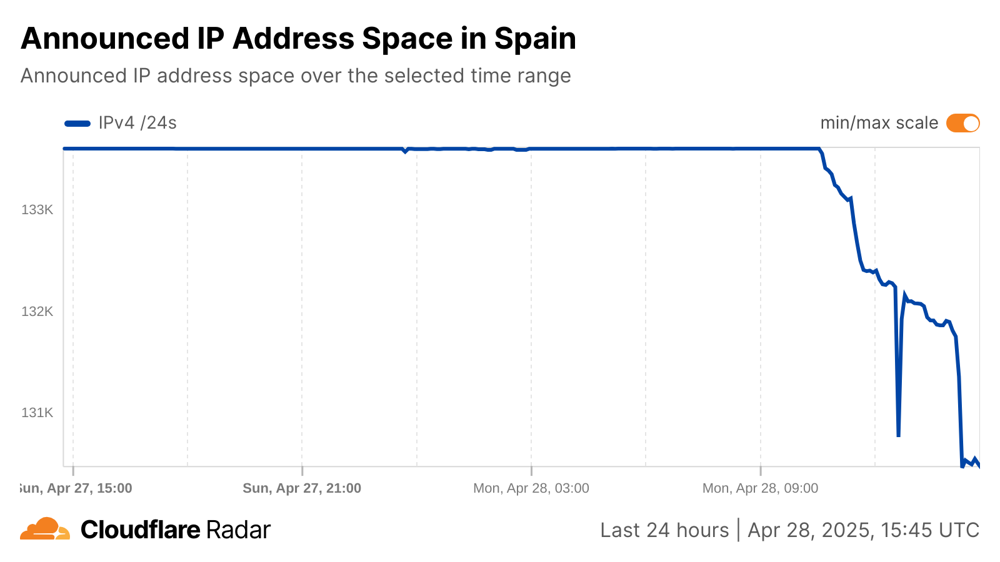

# Power Outage in Spain and Portugal Severely Disrupts Internet Connectivity

On April 28, 2025, at 10:34 UTC, a massive power outage swept across large parts of Portugal and Spain, leaving millions in the dark and disrupting services across industries. One of the most critical casualties of this blackout was Internet connectivity, as both countries saw dramatic drops in traffic, slower speeds, and even portions of their networks going offline. This article explores how the outage in Spain unfolded, the immediate and ongoing impacts on Internet traffic and quality, and what steps operators and users can take as power is gradually restored.

## Immediate Impact on Spain’s Internet

When the grid collapsed, traffic to Cloudflare’s network from Spanish IP addresses plummeted immediately by roughly 60% compared to the same time the previous week. Within five hours, traffic dipped to nearly 80% below normal levels, illustrating just how dependent end users and businesses are on a steady electricity supply.

### Country-level traffic drop in Spain  
  
*Source: Cloudflare Blog*

## DNS Resolution and Core Services

Even DNS traffic was not spared. Requests to Cloudflare’s public resolver (1.1.1.1) fell by 54% at the onset, briefly stabilizing before trailing off further as backup power systems began to exhaust their capacity. This interruption in DNS resolution magnified the blackout’s effects, making even lightly used services unreachable for many users.

### 1.1.1.1 DNS traffic in Spain  
  
*Source: Cloudflare Blog*

## Network-Level Disparities

Analyzing traffic by Autonomous System Numbers (ASNs) revealed stark differences among major ISPs. The top five Spanish ASNs saw traffic declines in the range of 75–93% within hours, while smaller networks like Digi Spain Telecom dipped quickly then stabilized at a lower plateau. These disparities highlight how operators with robust backup power fared slightly better than those relying on utility-supplied electricity alone.

### Traffic by major Spanish ASNs  
  
*Source: Cloudflare Blog*

## Regional Variations and Recovery

Not all regions in Spain experienced identical levels of disruption. Navarre, La Rioja, Cantabria, and the Basque Country showed early signs of recovery, likely tied to swift power restoration efforts by Red Eléctrica de España. Other areas, particularly those farther from major urban centers, saw traffic continue to fall as backup power reserves dwindled.

### Regional traffic patterns in Spain  
  
*Source: Cloudflare Blog & Red Eléctrica de España update*

## Quality of Service: Speeds and Latency

Beyond sheer volume, the quality of Internet connections suffered significantly. Median download speeds across Spain, which normally hovered around 35 Mbps, sank to as low as 19 Mbps during peak blackout hours. Meanwhile, latency crept upward from a baseline of ~22 ms to peaks near 40 ms—symptoms of both congested alternate routes and limited redundancy in power infrastructure.

### Download speeds and latency in Spain  
  
*Source: Cloudflare Blog*

## Routing and Reachability

At the protocol layer, the number of announced IPv4 /24 blocks in Spain dropped by about 2.4% shortly after 14:30 UTC, and IPv6 /48 announcements fell by over 8%. This reduction in announced address space indicates that some network segments—especially smaller ISPs or edge routers—were entirely unreachable once their backup power ran dry.

### Routing impact in Spain  
  
*Source: Cloudflare Blog*

## Looking Ahead: Restoration and Resilience

Power restoration efforts were already underway as this analysis was published, but full Internet recovery may take hours or even days. Network operators are prioritizing critical infrastructure, and users can mitigate disruptions by:

- Using mobile data or alternative ISPs where possible.  
- Connecting through VPNs with endpoints in unaffected regions.  
- Implementing on-site backup generators for essential services.  
- Monitoring outage maps such as Cloudflare Radar – Spain.

## Further Reading

- How the power outage in Portugal & Spain impacted Internet  
- Cloudflare Radar – Spain  
- Red Eléctrica de España  

