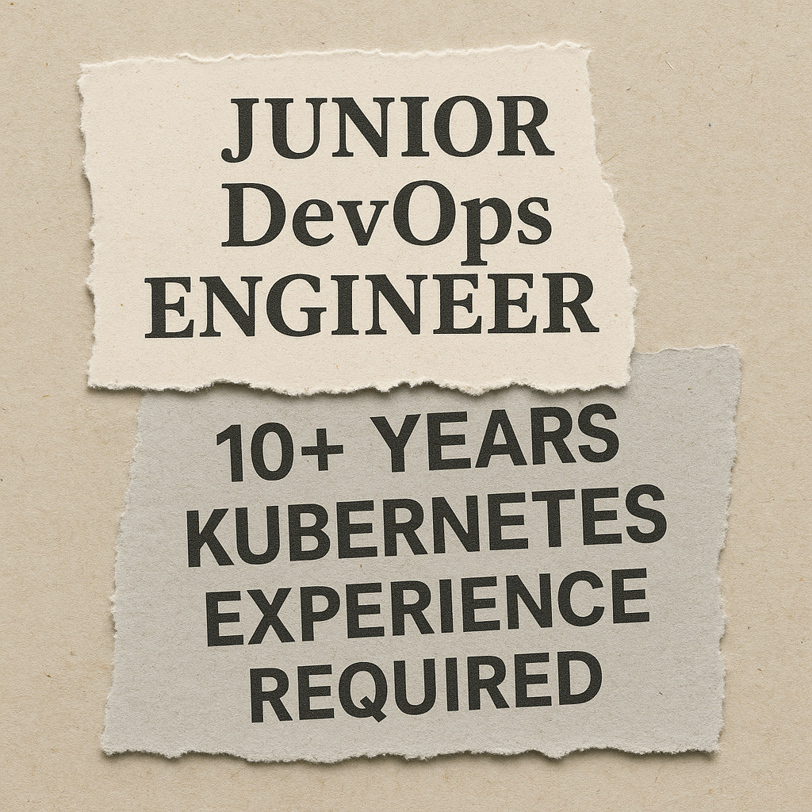
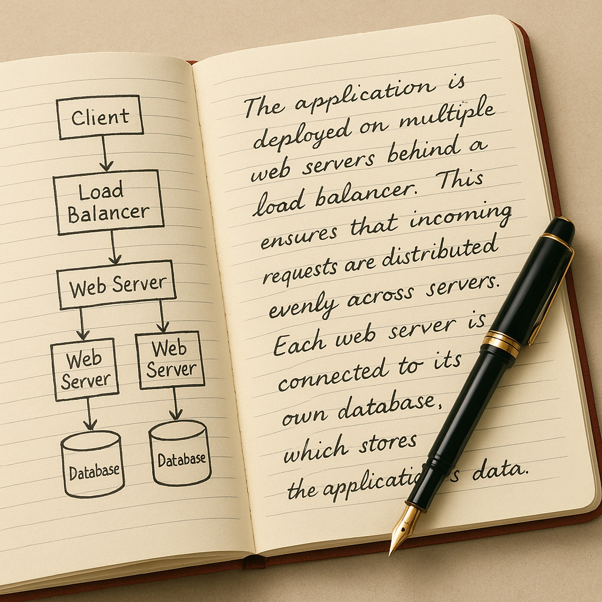

# The Sisyphus Effect in Tech: Why Your Job Search Feels Like Pushing a Boulder

The email notification flashed on my screen - another automated rejection. This made 43 applications over nine weeks. Five years ago, my DevOps and TypeScript expertise would have sparked bidding wars. Now? I was another senior engineer trapped in the modern tech job search purgatory, feeling like Sisyphus eternally pushing his boulder uphill only to watch it roll back down.

The Myth Meets Modern Reality

In Greek mythology, Sisyphus was condemned to perform futile labor for eternity. Today's engineers face their own version: crafting meticulously tailored applications, grinding through take-home assessments, and preparing for marathon interview loops - only to face ghosting, rejection, or worse, discovering the role never existed.

The tragedy isn't our lack of skill. With expertise spanning Kubernetes infrastructure, TypeScript frameworks, and cloud-native architectures, we're more capable than ever. The tragedy is how modern hiring systems have weaponized our efforts against us, transforming what should be a meritocratic process into an exercise in existential frustration.

Flaw 1: The Chimera Job Description

Recruiters increasingly seek mythical "purple squirrels" - candidates checking every impossible box. I recently saw a posting requiring 8 years of experience with a framework that only existed for 5 years. This isn't just absurd; it's a systemic failure. Companies copy-paste buzzword-laden requirements while actual teams need adaptable problem-solvers.

The result? Roles stay open for months while qualified candidates get rejected by algorithms searching for keyword incantations rather than engineering competence. When I applied for a TypeScript role, my resume was filtered out for listing "Node.js" instead of "NodeJS" - a single space character became my boulder.

Flaw 2: The Automated Abyss

Applicant Tracking Systems (ATS) have become the Cerberus guarding hiring gates. These tools prioritize keyword density over human potential, filtering out unconventional career paths and self-taught talent. I watched a brilliant colleague with open-source contributions get rejected because his resume "only" had 72% keyword match.

Worse, these systems create feedback vacuums. After submitting 20 applications into void-black portals with zero acknowledgment, even the most resilient engineer questions their worth. This isn't efficiency - it's institutionalized dehumanization.

Flaw 3: The Empathy Deficit

We engineer systems with redundancy and graceful failure, yet tolerate hiring processes where human judgment arrives only at the final stage. Technical screens conducted by disengaged contractors. Take-home projects demanding 20 unpaid hours. "Culture fit" assessments that covertly filter for age and background.

This mirrors the very dysfunction I described in my "Empathy in Scalable Systems" article. When hiring lacks the empathy we embed in our software, the system collapses under its own technical debt.

The Research Mindset Shift

My breakthrough came when I stopped counting rejections and started documenting patterns. Each "no" became data for my "Hiring System Teardown" journal. When 70% of full-stack roles mentioned "authentication integration," I built a secure JWT implementation (expanding on my Node.js guide) and made it the centerpiece of my profile.

Suddenly, interviews shifted from abstract quizzes to concrete discussions about my solution. Engineers asked thoughtful questions about token refresh strategies. Hiring managers referenced my case study. By framing my job search as a systems analysis project, I stopped pushing the boulder and started disassembling it.

Every Sisyphus knows his boulder's weak spots. I identified three critical failure points in my journey:

Resume Black Holes
Solution: Created "JD resonance" documents mapping keywords to specific achievements:
*"Reduced deployment failures by 40%" → "CI/CD pipeline optimization"*
"Container security" → "Implemented layered Docker builds"

Technical Screen Anxiety
Solution: Pre-solved industry-specific challenges:
Fintech roles? Prepared cache-invalidation war stories
Health tech? Rehearsed HIPAA-compliant architecture patterns

Culture Fit Ambiguity
Solution: Mirrored language from target companies' engineering blogs:
"Your post on psychological safety inspired my team's retrospectives"

Becoming the Wedge

When fintech job descriptions kept mentioning "legacy C# modernization pain," I shared snippets from my "Problem → Solution" framework showing how I reduced technical debt by 60% in a similar system. Recruiters started reaching out about my methodology - not just my skillset.

This is the engineer's advantage: We see systems where others see chaos. Your job search isn't a punishment loop; it's a distributed system needing debugging.

The Toolshed: What Sisyphus Would Pack Today

Replace generic "Responsibilities" bullets with solution narratives:
*"Instead of 'Used Terraform,' write:
'Chose Terraform over Ansible for state management after discovering race conditions during multi-region deployment. Reduced environment drift by 75%.'"*

The Empathy Hook

When applying to a health tech company, I referenced their CTO's talk about healthcare.gov's failure. The hiring manager later confessed: "Nobody else understood why that mattered."

Beyond the Summit

That first call came unexpectedly. "Your Healthcare.gov analysis made me realize we're repeating those mistakes," said the engineering director. We spent 30 minutes discussing integration patterns rather than rehearsing algorithms. The boulder wasn't gone - but I'd found better leverage.

Sisyphus's curse wasn't the labor; it was the absence of meaning. Our advantage as engineers is finding purpose in systems analysis. Every rejected application exposes flawed requirements. Every ghosting reveals broken pipelines. Every take-home test measures process toxicity more than skill.

The market may feel frozen, but cracks are appearing. Companies drowning in 3,000+ applications per role are quietly desperate for engineers who demonstrate systems thinking. Your job search isn't evidence of failure - it's a diagnostic tool revealing where the industry needs your expertise most.

