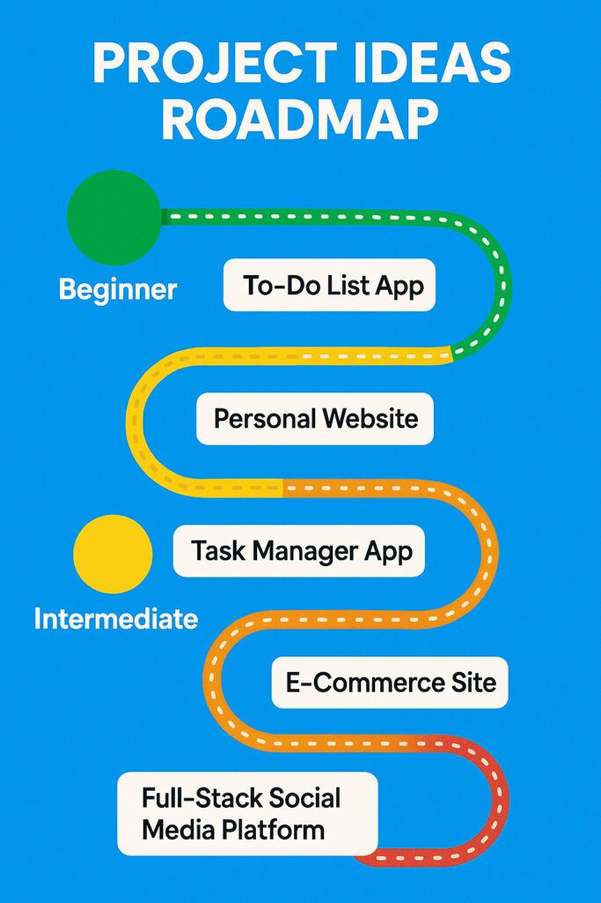

# The Ultimate Open-Source Project Roadmap for Web Developers: From Beginner to Pro (with JavaScript Starters)


If you’re eager to truly accelerate your growth as a web developer, let me share what’s worked wonders for me: building real, open-source projects. Through my own experience, I’ve discovered that nothing beats the combination of hands-on practice, tangible portfolio pieces, and the invaluable connections that come from collaborating within the global developer community. I started just like you—wondering what to build at each stage, and how to turn learning into something useful, visible, and even a bit inspiring.


That’s why I’ve put together this step-by-step roadmap, based on my journey and the lessons I’ve picked up along the way. Here, I’ll walk you from complete beginner all the way to professional, outlining open-source projects you can tackle at every level. I’m including practical JavaScript examples that helped me kick off my own contributions, so you can hit the ground running as well.




Why Open Source Matters?


Open source has been about so much more to me than just code you can use for free. It’s where I experienced first-hand the power of teamwork, learned to follow (and eventually shape) industry best practices, and contributed to projects that make a difference for myself and others. In fact, when hiring managers check out my GitHub, my open-source work is always what catches their eye—it’s clear proof of initiative, real-world skills, and the capacity to work well with others.


So, wherever you are on your web development journey, join me as we explore the projects that have shaped my growth and can transform yours too.


Project Ideas By Skill Level:


🟢 Beginner Projects


1. To-Do List App


Skills: HTML, CSS, JavaScript


Start by building a simple UI allowing users to add, delete, and tick off tasks.


Make it open source: Add setup instructions and label easy issues for new contributors.


If you're just beginning to explore the world of web development, building a To-Do List App is a rite of passage and a surprisingly rich learning experience. This seemingly simple application is a sneakily powerful teacher—it introduces you to the essential concepts that underpin every great web app, all in a package you can understand, expand, and share.


In its most basic form, a To-Do List App consists of an input box for new tasks, a list that displays them, and buttons or checkboxes to mark tasks as complete or remove them. But don’t let the simplicity fool you. As you craft your solution, you'll get hands-on practice with HTML for building structure, CSS for styling, and—most importantly—JavaScript for making your site interactive.


The journey begins when you write your first function to add tasks to a list. Suddenly, you’re manipulating the DOM, listening for user events like clicks or keypresses, and handling form data. Each improvement you make—whether it’s editing tasks, checking them off, or storing them in the browser’s local storage so they persist after a page reload—exposes you to best practices in programming, problem solving, and user experience design.


A To-Do List App is also incredibly approachable as an open-source project. The scope is just right for first-time contributors: clear goals, an easy codebase to navigate, and endless potential for enhancements. You might invite others to help with features like task filtering, drag-and-drop sorting, priority labels, or even basic theming. Carefully writing a README that encourages others to try your code and suggest improvements makes your repository an inviting place for community growth.


What’s more, your To-Do List App will be your coding sandbox—a safe space to experiment with new ideas, learn debugging skills, and become comfortable with GitHub’s collaborative tools like branches, commits, and pull requests. As you share your project, you’ll learn how to describe bugs, propose solutions, and give (or receive) constructive feedback.


It may be humble, but when you build, refine, and release a To-Do List App as your first open-source project, you’re taking your very first steps as a web developer and open-source contributor. You’ll look back someday and see just how far you’ve come—while knowing that the basic challenges you conquered here are the foundation for all the bigger apps you’ll dream up next.


A Simple JavaScript Example: Adding New Tasks


Here’s a basic snippet that lets you add a new task to the list with the click of a button:


```
document.querySelector('#addTask').onclick = function() {
  const input = document.querySelector('#newTask');
  if (input.value.trim() !== "") {
    const task = document.createElement('li');
    task.textContent = input.value;
    document.querySelector('#taskList').appendChild(task);
    input.value = "";
  }
}
```


With just a few lines of code, you’re making dynamic, interactive web pages—a major step up from static sites!


A To-Do List App is the classic first project for a reason: approachable, infinitely expandable, and welcoming to collaborators of every experience level. Open sourcing even a simple project like this makes you part of the global coding community from day one, and lays the groundwork for every future achievement.


2. Personal Website


Skills: HTML, CSS, JS basics


Showcase your bio, projects, contact info and certificates.


Make it open source: Offer custom theme options and ask for design contributions.


For new web developers, building a personal website is often the essential first step into the world of creating for the web. It is much more than a technical exercise—it’s your professional introduction to the world, a living portfolio, and a celebration of your progress as a coder, designer, and thinker.


When you start your personal website, you begin by sketching out your online identity. What do you want others to know about you? This leads you to consider not only which skills and projects to showcase but also how to present yourself with clarity and confidence. The process demands self-reflection—what’s your journey, what are your goals, and what makes your approach unique?


You’ll be surprised at how much you learn from the basics: structuring your profile with HTML, styling layouts with CSS, and adding simple JavaScript to make your site interactive. Elements like a smooth-scrolling navigation bar, image galleries, project cards, or a contact form challenge you to focus on responsive, user-friendly design. As your confidence grows, you might even add animations, dark mode toggling, or minimalist themes that reflect your personal taste.


The personal website is also a launching pad for every future opportunity. By linking to your resume, GitHub, LinkedIn, and highlighting your top projects, you make it effortless for potential employers, collaborators, or community members to find and connect with you. Even a basic blog or updates section gives you a platform to share your learning journey, insights, or project retrospectives, which can spark conversations and lifelong connections.


What makes a personal website especially powerful as an open-source project is its accessibility to others at the same stage. You can share your code and invite others to use it as a template, fork it, or contribute improvements. By documenting your setup, you help the next generation of learners get started—and you might be surprised how quickly your portfolio turns into a mini community project, with contributors from around the world tweaking layouts, fixing bugs, or adding new features.


For many, the personal website becomes a living document. It evolves as your skills, style, and ambitions evolve. Version control introduces you to Git and GitHub, while deploying your site on platforms like GitHub Pages, Netlify, or Vercel gives you real-world experience with web hosting and custom domains.


A personal website may seem simple, but building and maintaining one marks you as a developer who is organized, communicative, and invested in their growth. It's your digital handshake—the first impression you give to the world, and the one you’ll revisit and improve throughout your career.


A Taste of Code: Contact Form Interaction


Here’s a simple JavaScript snippet for handling a contact form submission, adding a touch of interactivity that you can expand as your site grows.


```
document.querySelector('#contactForm').onsubmit = function(e) {
  e.preventDefault();
  alert('Thanks for reaching out! I’ll respond soon.');
  this.reset();
}
```


This little piece brings a personal touch to your site and helps get you thinking about future enhancements, like integrating real email sending functionality or storing messages securely.


Launching your personal website is a foundational moment in your journey as a web developer. It reflects not just what you can do, but who you are—and as an open-source project, it’s also a reminder that your story matters and that community begins with sharing even the smallest of beginnings.


🟡 Intermediate Projects


3. Task Manager with Local Storage


Skills: JavaScript modules, LocalStorage API:


```
// Save tasks to LocalStorage
localStorage.setItem('tasks', JSON.stringify(tasksArray));
// Load on page initialization
const tasksArray = JSON.parse(localStorage.getItem('tasks')) || [];
```


4. Blogging Platform


Skills: Node.js, Express, MongoDB, REST APIs


User authentication, article CRUD, commenting, and basic admin panel.


Open source: Split issues into backend and frontend for easy collaboration.


Creating your own blogging platform is so much more than just crafting an online diary—it’s an opportunity to engineer a versatile content management system from the ground up. Unlike a to-do app or a simple portfolio, a fully functional blogging platform teaches you how to manage complex data relationships, user authentication, and user-generated content, all while focusing on good design and user experience.


At its core, a blogging platform connects writers with readers. When bringing this idea to life, one of your first technical hurdles is user registration and authentication. You learn to implement secure sign-up, login, and password reset functionality—protecting content while providing a smooth onboarding process for new writers. Once users can log in, you’ll build robust forms to let them create, edit, and publish blog posts using rich text editors. Adding Markdown support, image uploads, or even code formatting adds useful bells and whistles, showing your ability to enhance user experience and handle different data types.


Making content discoverable and engaging is at the heart of what keeps users coming back. You’ll design a clean homepage that showcases recent or popular posts, and develop navigation schemes—categories, tags, or even search—that help readers find topics that interest them. Behind the scenes, connecting blogs to their respective authors, timestamps, tags, and comments requires thoughtful schema design, whether you’re using a NoSQL solution like MongoDB or a traditional relational database.


Comments and feedback mechanisms add another layer of complexity. Implementing nested comments, likes, or reactions, and moderating user input (for spam or abuse) draws you into the worlds of data validation and security. You’ll tackle issues such as sanitizing input to prevent XSS attacks, moderating content, and giving admins the tools necessary to maintain a healthy community.


For those with an eye on performance and modern best practices, building RESTful APIs or experimenting with GraphQL can make your platform fast, flexible, and ready to power other apps, like mobile clients. On the frontend, whether you use plain JavaScript or a library like React, you’ll deepen your understanding of state management, component architecture, and responsive layouts that work on any device.


What sets a blogging platform apart as a fantastic open-source project is how it fosters collaboration. Writers and developers both benefit from new features—think social sharing, reading statistics, custom themes, or multi-user roles. Clear documentation and a simple setup process welcome other contributors and users to the project, turning your code into a living community tool.


When you open your blogging platform to others—by posting the repo online, managing issues and pull requests, and responding to feedback—you gain a taste of what it’s really like to work on professional, community-driven software. You manage competing ideas, prioritize improvements, and teach or learn new techniques with every contribution.


Sample: Posting a New Blog Article with Node.js/Express


Here’s a simple example for creating a blog post, hinting at the real challenges of building content management features:


```
// Express route to create a new blog post
app.post('/api/posts', async (req, res) => {
  const { title, body, authorId } = req.body;
  const newPost = new Post({ title, body, author: authorId, date: new Date() });
  await newPost.save();
  res.status(201).json(newPost);
});
```


This snippet is just the tip of the iceberg—as your project grows, you’ll support editing, deleting, searching, and displaying articles, locking down permissions to ensure only the right users can make changes.


Building a blogging platform is the bridging point between beginner and advanced web development. It’s your playground for creativity, your proving ground for skills, and your invitation to others to share stories and build better software together. When you release it as open source, you’re not just writing code—you’re creating a space for voices and ideas to thrive.


🟠 Advanced Projects


5. E-Commerce Site


Skills: MERN Stack (MongoDB, Express, React, Node.js)


Building a fully functional e-commerce website goes beyond coding—it’s about understanding how technology can power real businesses and solve practical problems for buyers and sellers around the world. Diving into this project, you find yourself recreating the digital backbone behind platforms like Amazon, Etsy, or Shopify, and confronting many real-world challenges in the process.


The heart of any e-commerce platform is the product catalog and shopping cart. You’ll need to create mechanisms for vendors or administrators to add, update, and categorize products, each with images, specifications, pricing details, and inventory levels. On the customer side, presenting these products beautifully and intuitively—complete with search, filter, and sort options—requires frontend design sense as well as technical proficiency. The cart itself must feel seamless, allowing users to add or remove items, save favorites for later, and see real-time updates as they browse.


Checkouts are where technical complexity and user trust intersect most intensely. Secure handling of sensitive information—especially payment details—demands rigorous security practices. By integrating payment gateways (like Stripe or PayPal), you not only learn how to interact with third-party APIs but also deepen your understanding of encryption, tokenization, and legal standards like PCI compliance. You’ll have to manage successful and failed transactions, inventory adjustments, order confirmations, and digital receipts, each of which is essential to a smooth e-commerce user journey.


Behind the scenes, your backend code will orchestrate order management, stock tracking, user profiles, and possibly even shipping and tax calculations, all while ensuring the application remains scalable as the number of products and active users increases. Storing data efficiently, optimizing queries, and predicting future enhancements—like offering discounts, email marketing, or wish lists—will shape how you architect your database and APIs from day one.


No two e-commerce shops are exactly the same. Building features like customer reviews, dynamic pricing, promotional banners, and personalized recommendations gives you the chance to experiment with both product and user data in meaningful ways. With real-world stakes involved, you’ll also have opportunities to implement audits, logs, detailed error messages, and administrative dashboards for business owners to oversee and manage every aspect of the store.


Opening up your e-commerce codebase to the open-source community broadens these experiences enormously. You’ll encounter questions and feedback from contributors who run similar businesses or have faced similar coding roadblocks. For example, someone may want to localize the checkout flow for another country, improve accessibility for disabled users, or upgrade the image-handling pipeline for higher performance. Collaboration in these cases isn’t just about writing code together; it’s about solving business problems as a team.


From a career perspective, an open-source e-commerce platform offers tangible proof of your ability to understand customers, manage security, scale applications, and adapt to constantly changing requirements. It becomes a showcase for potential collaborators and employers—demonstrating not only your technical skills but also your capacity to think like a business owner.


When you finish your own e-commerce website, whether it serves a real vendor or simply acts as a playground for new features, you’re not just ticking off another project from a learning roadmap. You’re demonstrating to yourself and others that you can build and maintain the kind of critical web infrastructure that powers the modern world.


A Glimpse of Real Code: Managing Product Listings


Imagine how you might create, edit, and display products dynamically—handling all the details needed for real stores. Here’s a simplified snippet using JavaScript (Node.js/Express):


```
// Basic route to add a new product (Node/Express)
app.post('/api/products', async (req, res) => {
  const { name, description, price, imageUrl } = req.body;
  const newProduct = new Product({ name, description, price, imageUrl });
  await newProduct.save();
  res.status(201).json(newProduct);
});
```


By connecting routes like this with a well-designed frontend, you empower business owners to manage their catalogs and customers to browse, buy, and receive orders—all within a secure, open-source application that grows in features and complexity over time.


Building an e-commerce site is not just about shopping carts and payment buttons. It’s an adventure in bringing ideas to market, a lesson in building trust, and a powerful way to learn what it takes to code for the businesses that shape our digital lives.


🔴 Professional Projects


6. Full-Stack Social Media Platform


Skills: React (or Vue/Angular), Node.js, MongoDB, WebSockets (Socket.io)


Features like real-time chat, posts, likes, friendships, notifications, file uploads.


Open source: Actively review PRs, manage issues, and write contributing docs. Host regular open contributor calls!


Building your own social media platform is the gold standard for web developers looking to prove their skills. Unlike simpler projects, a social media application brings together everything you must master to succeed in the professional world—intuitive user interfaces, robust backend systems, real-time interactions, and scalable databases. This ambitious project immerses you in the kinds of technical and user experience challenges typically handled by large groups of engineers in top tech companies.


At the heart of your platform is the concept of connection. You'll give users the ability to create personal profiles, share their thoughts through posts, comment and like each other’s content, and build networks of friends or followers. Each of these features may sound simple on the surface, but implementing them requires creative problem-solving. For instance, every account must be protected—requiring security features like hashed passwords and session management, as well as responsive error handling so users always feel in control.


As you progress, the importance of data structures and efficient communication between client and server becomes clear. Showing a live feed of posts, for example, means designing a database schema that supports quick querying and frequent writes. Add in features like notifications or direct messaging, and now you need to introduce real-time technology such as WebSockets. Suddenly, your application is not just “full stack”—it’s interactive and dynamic, creating the immediate feedback users expect from modern platforms.


Working on a project of this scale forces you to adopt best practices. You’ll need to write modular, maintainable frontend code—perhaps with React components and context providers that handle authentication state or post feeds. On the backend, a REST API or GraphQL endpoint will let you deliver information securely and efficiently, and you’ll have to think about error handling, data validation, and API rate limiting to keep your system reliable and safe.


Incorporating features like media uploads brings another layer of challenge. Storing and serving user avatars or shared images can’t be done effectively with your main application server, so you’ll need to bring in external storage solutions and connect them via APIs. Supporting real-use scenarios—such as searching for people, displaying trending posts, or managing friend requests—gives you a taste of how professional software engineers tackle complex, evolving requirements.


Perhaps most importantly, as an open-source project, your social media platform can become a living, breathing community. With a clear README, an inviting issues tracker, and supportive contribution guidelines, you can onboard other developers, designers, and testers. Discussing new features, reviewing pull requests, and planning releases are part of the experience, teaching you collaboration skills that few coding tutorials can offer.


In the end, building a full-stack social media app is more than just a technical achievement. It’s a demonstration of creativity, architecture, attention to detail, and the ability to execute on a vision bigger than a single developer. Whether prospective employers, potential collaborators, or curious users visit your repository, they’ll see clear evidence of your drive and capability—as well as a community project that continues to evolve.


Example: A Taste of Real-Time Messaging


One of the standout features of any social platform is live messaging. By connecting users through WebSockets (using a library like Socket.io in Node.js), you can allow conversations to happen in real time, with new messages appearing instantly as they’re sent. This involves not just building the logic for sending and receiving messages, but also handling scenarios where users disconnect and reconnect, ensuring no data is lost and everyone feels included.


```
// Node.js + Socket.io simplified server example
const io = require('socket.io')(3000);

io.on('connection', socket => {
  socket.on('send-message', (msg) => {
    // Broadcast the message to all other users
    socket.broadcast.emit('receive-message', msg);
  });
});
```


On the frontend, you’d attach listeners to update the chat UI as soon as a new message is received, blurring the line between traditional web applications and live, interactive experiences.


Tackling a full-stack social media platform is a rewarding journey. You’ll discover firsthand the challenges—and the joys—of building software that brings people together. When you release it as open source, you don’t just showcase your technical prowess; you invite the world to learn, improve, and create alongside you.


Tips for Making Your Project Open Source


Write a Great README: Clear install and usage steps.


Add a License: MIT or Apache 2.0 are beginner-friendly.


Use GitHub Issues & Discussions: Track bugs, features, and feedback.


Welcome Contributors: Use labels like good first issue, and write a CONTRIBUTING.md.


Continuous Deployment: Deploy with Netlify, Vercel, or Heroku so anyone can try it.


How to Start


Pick a project idea above that fits your skills, but pushes your boundaries.


Create a public repository. Write initial code—even if it's just a “Hello World.”


Document your process. Share progress on LinkedIn or Twitter, and invite feedback.


Encourage others to try, use, and contribute to your app.


Why Build Open Source Projects?


You’ll build a portfolio that proves your skills to employers.


You’ll practice real teamwork and code review.


You’ll master tools like Git, GitHub, and CI/CD.


Best of all, you’ll learn faster by collaborating with others!


💡 Ready to start your open-source journey?


What project are you excited to try? Leave a comment or connect with me to collaborate on something new!


