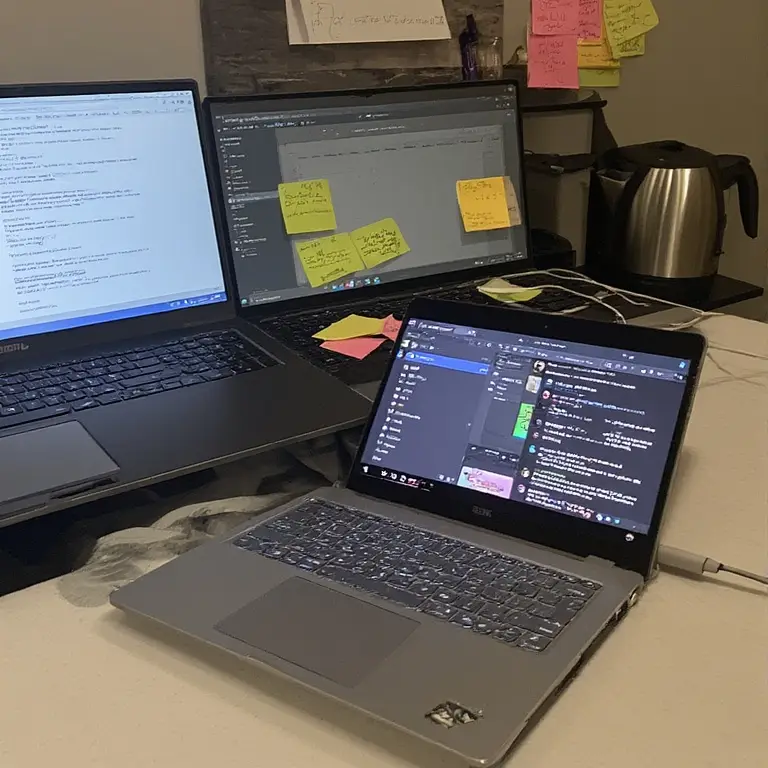

# Why Constant Context-Switching Is Costing Your Company More Than You Think

You know that feeling when an email pings, a Slack thread lights up, and your calendar nudges you toward a meeting — all within ten minutes? That tiny, repeated interruption isn’t just annoying. It’s quietly eating your company’s time, attention, and momentum.

Most leaders measure cost in headcount and billable hours. What slips under the radar is the attention tax: the productivity, quality and innovation you lose every time someone is yanked out of focused work. It’s not dramatic, so it’s easy to shrug off. But small losses, repeated every day across dozens or hundreds of people, compound fast. 

Think about product development. A designer starts a deep session to prototype a feature, gets pulled into a cross-functional check-in, then answers messages about an unrelated bug. When she returns to the prototype, momentum is gone. Relearning the thread, re-finding the mental model, re-focusing — that rebuild takes longer than the interruption itself. Now multiply that by the number of deep work hours your teams should be spending each week.

Think about product development. A designer starts a deep session to prototype a feature, gets pulled into a cross-functional check-in, then answers messages about an unrelated bug. When she returns to the prototype, momentum is gone. Relearning the thread, re-finding the mental model, re-focusing — that rebuild takes longer than the interruption itself. Now multiply that by the number of deep work hours your teams should be spending each week.

This problem shows up in different guises. It’s unclear role boundaries that force engineers into meetings they shouldn’t attend. It’s too many tools, each with notifications beckoning for immediate attention. It’s the “always-on” culture that equates responsiveness with value. And it’s leaders who reward reactivity — the person who answers the fastest — rather than the person who ships better work.

Beyond missed deadlines, the hidden costs are cultural. Constant context switching burns people out. It makes work feel shallow. Creative, high-leverage thinking — the stuff that moves a business forward — requires uninterrupted time. When busywork crowds out that time, hiring more people or extending timelines becomes the default “fix,” rather than addressing the root cause.

So what helps? Start by treating attention like a scarce resource. Protect it deliberately. That doesn’t mean banning meetings or being rigid — it means setting norms that prioritize focus: meeting-free blocks, clearer agendas, fewer platforms, and shared rules about urgent vs. non-urgent interruptions. It also means re-evaluating who really needs to be in a meeting and whether real-time is the best channel for a decision.

Tools can help, but process matters more. An async-first habit — decisions documented, updates posted, meetings used for alignment rather than status updates — reduces unnecessary context switches. Role clarity and stronger handoffs reduce the “who owns this?” bounce that creates continuous interruptions. And measurement is important: track deep work hours as a health metric, not just filled calendar time.

If your instinct is to hire more people to get out of the weeds, pause. Often the better hire is someone who can redesign the workflow: simplify dependencies, restore attention to engineers and creatives, and shift the team from reactive to intentional work. That change feels subtle at first, but it multiplies: fewer interruptions, higher quality output, faster delivery, and a less frantic culture.

The math is simple when you look beyond timesheets. Less context switching = more focused expertise, fewer mistakes, and a team that actually builds forward instead of constantly catching up. If your organization still treats constant reactivity as normal, the real question isn’t whether you’ll hire — it’s whether you can afford not to change how work happens.

