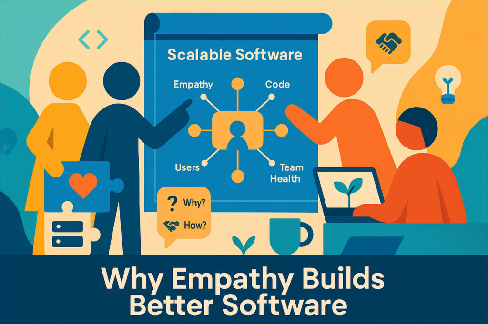

# Why Empathy is the Hidden Engine of Scalable Software: Building Tech That Lasts (and Teams That Thrive)

Introduction: The Myth of the Lone Genius Coder

In 2013, the launch of Healthcare.gov—a platform intended to revolutionize access to healthcare in the U.S. — became a cautionary tale for the tech industry. Despite months of development, the site crashed within hours of going live. Users encountered endless error messages, slow load times, and broken features. Behind the scenes, teams were siloed, deadlines were unrealistic, and critical feedback was ignored in favor of ticking boxes. The result? A $300M failure that wasn’t just a technical disaster—it was a human one.

This story underscores a truth often overlooked in software engineering: Scalability isn’t just about servers and code. It’s about people. The myth of the “lone genius coder” has long dominated tech culture, but the reality is that software thrives when empathy—for users, teammates, and stakeholders—is woven into its DNA. Empathy isn’t a “soft skill” to tack onto sprint retrospectives. It’s the hidden engine that powers systems to evolve, teams to innovate, and products to endure.

In this article, we’ll explore how empathy shapes every layer of software development, from architecture decisions to team dynamics. You’ll learn why ignoring empathy accelerates technical debt, how companies like Spotify and Microsoft build empathy into their workflows, and actionable strategies to foster human-centric engineering.

Part 1: Redefining Empathy in Software Engineering

Empathy is often reduced to vague platitudes like “walk in someone’s shoes.” In software engineering, it’s far more concrete. Let’s break it down:

User Empathy: Beyond Edge Cases
User empathy isn’t just about fixing bugs—it’s about understanding the unspoken needs of the people who interact with your product. Consider accessibility: When developers at Microsoft redesigned the Xbox Adaptive Controller, they didn’t just comply with guidelines. They spent months collaborating with gamers with disabilities, observing how they navigated interfaces. The result was a device that empowered users rather than patronizing them.

Team Empathy: Psychological Safety as a Feature
Google’s Project Aristotle revealed that psychological safety—the belief that teams won’t punish risk-taking—is the #1 predictor of high-performing teams. Yet many engineering cultures still reward heroics over collaboration. Imagine a junior developer hesitating to flag a design flaw because they fear being labeled “difficult.” That silence isn’t just a cultural failure—it’s a technical liability.

Stakeholder Empathy: Bridging the Tech-Business Gap
When engineers dismiss business stakeholders as “non-technical,” they miss opportunities to align priorities. A CTO once shared how her team spent months building a “perfect” API—only to learn stakeholders needed rapid prototyping, not scalability. Empathy here means asking, “What does success look like for you?” before writing a single line of code.

Part 2: The High Cost of Empathy Debt

Technical debt is a familiar concept, but empathy debt—the compounding cost of ignoring human needs—is equally destructive.

Case Study: When Speed Kills Collaboration
A fintech startup rushed to launch a payment gateway, sidelining QA testers to meet investor deadlines. Post-launch, edge cases piled up: transactions failed for users in rural areas with spotty internet. Engineers blamed “legacy code,” but the root cause was deeper. By excluding QA from early design meetings, the team had ignored critical feedback about error handling. The fix took six months—and lost customers.

The Feedback Loop of Burnout
A DevOps team, pressured to maintain 99.99% uptime, automated monitoring without documenting processes. When a lead engineer quit, the team spent weeks reverse-engineering her scripts. Burnout spread, and incidents increased by 40%. DORA metrics highlight this pattern: Teams with low psychological safety see 50% longer recovery times from outages.

Framework: The Empathy-Driven Development Cycle
To break this cycle, teams need structured empathy checkpoints:

Plan with Context: Map user journeys before architecting systems.

Build Inclusively: Pair developers with support teams to preview pain points.

Review Holistically: Retrospectives that ask, “Who did we overlook?”

Iterate Transparently: Share post-mortems across departments, not just engineering.

Part 3: Empathy in Action — Stories from the Field

Spotify’s “Health Check” Rituals
Spotify’s engineering teams use “health checks” to gauge team dynamics. Metrics like “We deliver painlessly” and “We trust each other” are rated quarterly. One team discovered their “low trust” scores correlated with rushed deployments. By revisiting their CI/CD pipeline and improving sprint planning communication, they reduced incidents by 60%.

Microsoft’s Inclusive Design Revolution
Microsoft’s Inclusive Design Toolkit mandates involving marginalized users in every design phase. When building the Seeing AI app for visually impaired users, engineers partnered with advocacy groups from day one. The app’s “currency scanner” feature—requested by users—now helps millions navigate financial independence.

Open Source: Where Empathy Meets Governance
The Python community’s PEP (Python Enhancement Proposal) process is a masterclass in empathetic governance. Proposals require documenting not just technical specs, but impact on diverse users. PEP 8, the style guide, evolved through years of community debate—proof that empathy scales.

Part 4: Tools for Human-Centric Engineering

For Teams: Retrospectives That Heal
Traditional retrospectives focus on “what went wrong.” Empathetic retros ask, “What drained your energy?” A team at Etsy introduced “gratitude rounds,” where members thank someone who helped them. This simple shift reduced blame and uncovered hidden bottlenecks, like a poorly documented API.

For Systems: Observability with a Human Lens
Modern monitoring tools track latency and errors, but what about user frustration? Tools like FullStory and Hotjar let engineers watch anonymized user sessions. One SaaS company discovered users abandoned their app not because of bugs, but because a loading spinner lingered 0.5 seconds too long. Fixing it boosted retention by 15%.

For Leaders: Metrics That Reflect Humanity
Engineering managers often obsess over sprint velocity. What if they tracked “empathy metrics” instead?

Feedback Loop Health: Time between feedback and action.

Knowledge Distribution: Percentage of tribal knowledge documented.

Inclusion Index: Diversity of voices in design meetings.

GitLab’s handbook-first approach—where every process is documented publicly—exemplifies this. New hires onboard faster, and decisions are transparent.

Part 5: The Future of Empathetic Tech

Ethical AI: Coding with Conscience
Facial recognition systems infamously fail for darker-skinned users. Teams at IBM and Google now employ “bias bounty” programs, rewarding engineers who uncover discriminatory patterns. Empathy here isn’t optional—it’s a safeguard against harm.

Remote Work: Async Without Isolation
Async workflows reduce meetings but risk eroding trust. GitLab’s “family and friends” Slack channel—where employees share personal milestones—fosters connection. Pair programming tools like Tuple include virtual coffee breaks to mimic office camaraderie.

Sustainability: Code for the Planet
Empathy extends beyond people. Tools like AWS’s Carbon Footprint Calculator let engineers measure their code’s environmental impact. Optimizing a legacy system at Netflix reduced energy use by 30%—equivalent to taking 6,000 cars off the road annually.

Conclusion: The Scalability of Caring

Software isn’t just a collection of binaries. It’s a living ecosystem shaped by human choices. The next time you architect a system, ask:

Who does this exclude?

What pain are we inheriting?

How can we leave the codebase better than we found it?

As Linus Torvalds once said, “Talk is cheap. Show me the code.” Let’s challenge that: “Talk is essential. Show me the empathy.”

Call to Action. Audit your current project through an empathy lens:

Host a “pre-mortem” to anticipate user pain points.

Invite a non-engineer to your next design sprint.

Document one process tribal knowledge relies on.

The road to scalable software starts with a single question: “Who matters here?”

